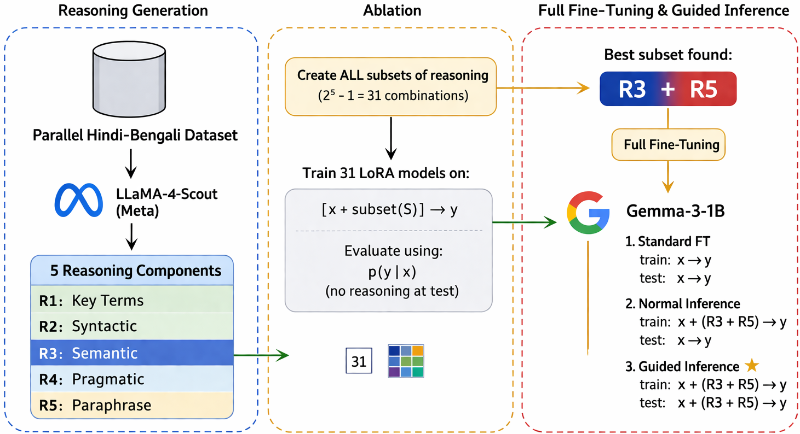

# Reasoning as Supportive Context for Machine Translation   


[📄 **Reasoning as Supportive Context for Machine Translation: A Case Study on Hindi to Bengali Language Pair**](https://doi.org/10.13140/RG.2.2.23116.37760) 

[](https://doi.org/10.13140/RG.2.2.23116.37760)
[](https://doi.org/10.13140/RG.2.2.23116.37760)

---

## 📖 Overview

This repository contains the implementation, experiments, and resources for the research paper:

> **Reasoning as Supportive Context for Machine Translation: A Case Study on Hindi to Bengali Language Pair**

This work investigates how structured reasoning can improve machine translation by acting as supportive contextual guidance during translation generation.

---

# 🖼 Pipeline Architecture

<p align="center">
  
</p>

<p align="center">
  <em>Overall framework of reasoning-guided Hindi → Bengali machine translation.</em>
</p>

---

## 🧠 Reasoning Components

The framework introduces five reasoning categories:

| ID | Reasoning Type |
|----|----------------|
| R1 | Key Terms |
| R2 | Syntactic |
| R3 | Semantic |
| R4 | Pragmatic |
| R5 | Paraphrase |

The study performs exhaustive experiments across all:

> **31 reasoning combinations**

---

## 🚀 Key Findings

- Increasing reasoning signals does not always improve translation
- Translation quality depends on reasoning composition
- Excessive reasoning may introduce noisy contextual signals
- The best-performing combination is:

>**Semantic (R3) + Paraphrase (R5)**

- Guided inference significantly improves translation quality

---

## 💡 Core Idea

Reasoning is not generated as the final output.

Instead, reasoning acts as:

> **Supportive context to guide machine translation**

---

## 🗂 Dataset

### Training Data
- 36,040 parallel sentence pairs

### Test Data
- 2,000 sentence pairs

### Domains
- Agriculture
- Tourism
- Governance
- Climate
- Healthcare
- Science & Technology
- Judiciary
- Education

---

## ⚙️ Methodology

### Training
- Instruction-tuned base model
- LoRA fine-tuning
- Structured reasoning prompts
- Full reasoning ablation study

### Inference Modes
1. Zero-Reasoning Inference  
2. Guided Inference using optimal reasoning subset

---

## 📈 Results Summary

- Compact semantic reasoning performs best
- Large reasoning combinations may degrade performance
- Training–inference alignment is critical
- Guided reasoning improves adequacy and fluency

---

## 🛠 Tech Stack

- Python
- PyTorch
- Hugging Face Transformers
- PEFT (LoRA)
- TRL
- Accelerate

---

## 📚 Citation

If you use this work, please cite:

```bibtex
@article{eamt6,
  title={Reasoning as Supportive Context for Machine Translation: A Case Study on Hindi to Bengali Language Pair},
  author={Singh, Kshetrimayum Boynao and Singh, Saksham and Pakray, Partha and Ekbal, Asif},
  booktitle={Proceedings of the 26th Annual Conference of the European Association for Machine Translation},
  publisher={European Association for Machine Translation (EAMT)}
}
```

---

## ⭐ Acknowledgement

This work contributes toward reasoning-enhanced machine translation for low-resource Indian languages and multilingual NLP research.